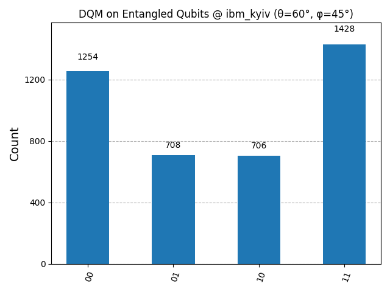
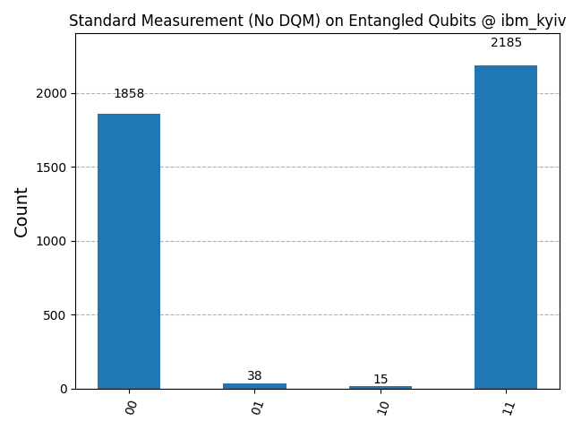

# Directed Quantum Measurement (DQM)
## A Framework for Controlled Collapse and Information Encoding Without Decoherence

**By Omar Zaror**  
*OMARINO Quantum Research Initiative*

[](https://github.com/OMARINO-DE/Directed-Quantum-Measurement-DQM)

---

## Abstract

The standard quantum measurement process is fundamentally probabilistic and leads to irreversible wavefunction collapse, often accompanied by decoherence and the destruction of entanglement. This inherent randomness presents a major obstacle to direct quantum information encoding and communication via entangled states. 

This repository presents a novel framework called **Directed Quantum Measurement (DQM)**, which postulates that wavefunction collapse can be conditionally biased through the presence of a **Directional Quantum Field (DQF)**. This field modulates collapse probabilities without violating the statistical structure of quantum mechanics, enabling partial or controlled measurements that preserve entanglement.

This work includes:
- Mathematical formulation for DQM
- Conceptual model for a Directed Measurement Apparatus (DMA)
- Numerical simulations demonstrating the theory
- Experimental implementations using IBM Quantum backends

Our findings suggest the possibility of encoding classical bits directly via quantum entanglement without the need for classical communication, potentially paving the way for faster-than-light quantum signaling. While speculative, DQM offers a new lens through which to examine the measurement problem and the informational boundaries of quantum systems.

---

## Table of Contents

1. [Introduction](#introduction)
2. [Theoretical Framework](#theoretical-framework)
3. [Installation](#installation)
4. [Experimental Implementations](#experimental-implementations)
5. [Usage Examples](#usage-examples)
6. [Research Findings](#research-findings)
7. [Future Directions](#future-directions)
8. [Citation](#citation)
9. [License](#license)

---

## Introduction

Since the inception of quantum theory, measurement has remained one of its most perplexing aspects. The Copenhagen interpretation posits that upon measurement, a quantum system's wavefunction collapses randomly to one of the eigenstates of the observable being measured. This collapse is not only unpredictable but also irreversible, and typically results in decoherence — the loss of entanglement and quantum superposition.

This randomness imposes a strict boundary on the direct transmission of information through entanglement. According to the no-signaling theorem, no information can be transmitted faster than the speed of light using entangled particles alone. However, recent explorations in the foundations of quantum mechanics suggest that this boundary may not be absolute under all theoretical frameworks.

### The DQM Paradigm

**Directed Quantum Measurement (DQM)** introduces a new approach based on the hypothesis that the probabilistic collapse of a quantum state can be **guided** — not determined, but **biased** — by an auxiliary informational field we call the **Directional Quantum Field (DQF)**. 

When applied to a shared entangled system, DQM enables a sender (Alice) to modulate the collapse tendencies of her particle, subtly influencing the measurement statistics observed by the receiver (Bob). Crucially, this influence occurs without the destruction of entanglement, due to the employment of reversible partial measurements.

---

## Theoretical Framework

### 2.1 Directional Quantum Field (DQF)

The Directed Quantum Measurement (DQM) theory introduces a mechanism by which the traditional stochastic collapse of a quantum state can be conditionally biased, or guided, through a supplementary construct called the **Directional Quantum Field (DQF)**. This field interacts with the quantum system at the level of wavefunction amplitudes, subtly adjusting the likelihood of specific outcomes during measurement without violating unitarity or introducing non-physical discontinuities.

We define the DQF as a non-local, informational field that can be tuned via two parameters: **θ (theta)** and **φ (phi)**, representing internal control degrees of freedom or external stimulus. The DQF modulates the state's components through a biasing function:

```
f(θ, φ) = 0.5 + 0.5 × sin(θ) × cos(φ)
```

Given a two-level quantum system |ψ⟩ = α|0⟩ + β|1⟩, the presence of the DQF transforms the state just before measurement into:

```
|ψ'⟩ = f(θ, φ) × α|0⟩ + (1 - f(θ, φ)) × β|1⟩
```

The state is normalized prior to measurement, and the modified amplitudes determine the resulting measurement probabilities. Unlike classical wavefunction collapse, this formulation suggests a form of "influence" rather than determinism, avoiding direct violation of the no-signaling principle under weak or partial measurements.

### 2.2 Directed Measurement Apparatus (DMA)

The **Directed Measurement Apparatus (DMA)** is a conceptual device capable of generating and applying the DQF. It must include:

- **Quantum Interaction Injector**: Enabling conditional biasing based on external inputs
- **Local Q-Environment Modulators**: Shaping the collapse environment
- **Entanglement Gradient Analyzers**: Preserving and measuring residual entanglement post-measurement

This apparatus must also allow for programmable modulation of θ and φ, enabling control of the collapse tendency in real-time.

### 2.3 Partial Collapse and Entanglement Preservation

To maintain entanglement while performing measurement, DQM incorporates the concept of **Reversible Partial Collapse**. Unlike full collapse, partial collapse modifies the quantum state without fully destroying coherence. It can be represented as:

```
|ψ⟩ → M_partial |ψ⟩ = γ₀|0⟩ + γ₁|1⟩, where |γ₀|² + |γ₁|² < 1
```

The post-measurement state retains information about the original superposition, and when entangled, allows the second particle to remain in a correlated state. Such interactions enable conditional control without full decoherence.

### 2.4 Bias-to-Angle Conversion

In practical quantum circuit implementations, the bias is converted to a rotation angle applied to the quantum state:

```
α = 2π × f(θ, φ)
```

### 2.5 Quantum Circuit Implementation

In the quantum circuit, the directional bias is applied via a rotation around the Y-axis (RY gate):

```
|ψ⟩ → RY(α)|ψ⟩
```

This rotation biases the measurement outcome without fully collapsing the superposition, allowing for controlled measurement statistics.

### Key Principles

1. **Non-deterministic Control**: DQM doesn't deterministically set outcomes but biases probabilities
2. **Entanglement Preservation**: Partial measurements maintain quantum correlations
3. **Information Encoding**: Classical information can be encoded in measurement bias
4. **Reversibility**: The measurement process can be designed to be reversible under certain conditions
5. **Probabilistic Guidance**: The system influences measurement outcomes through statistical bias rather than deterministic control

---

## Installation

### Quick Start

For detailed installation instructions, see **[SETUP.md](SETUP.md)**.

### Prerequisites

- Python 3.8 or higher
- pip package manager
- IBM Quantum Account (free) - for cloud experiments

### Setup Virtual Environment

#### Windows (PowerShell)
```powershell
python -m venv dqm-env
.\dqm-env\Scripts\Activate.ps1
```

Or use the provided batch file:
```powershell
.\setup_dqm_env.bat
```

#### Linux/macOS
```bash
python3 -m venv dqm-env
source dqm-env/bin/activate
```

Or use the provided shell script:
```bash
chmod +x setup_dqm_env.sh
./setup_dqm_env.sh
```

### Install Dependencies

```bash
pip install -r requirements_dqm.txt
```

### IBM Quantum Setup

1. Create a free account at [IBM Quantum](https://quantum.ibm.com/)
2. Get your API token from Account Settings
3. Save your token (one-time setup):

```python
from qiskit_ibm_provider import IBMProvider
IBMProvider.save_account('YOUR_IBM_QUANTUM_TOKEN', overwrite=True)
```

**⚠️ Security Warning:** Never commit your API token to version control! The repository includes a `.gitignore` file to prevent accidental commits.

For complete setup instructions, troubleshooting, and advanced configuration, see **[SETUP.md](SETUP.md)**.

### Required Packages

- `qiskit==2.0.0` - Quantum computing framework
- `qiskit-ibm-provider==0.9.0` - IBM Quantum backend access
- `matplotlib` - Visualization
- `numpy` - Numerical computing

---

## Experimental Implementations

This repository contains several experimental implementations of DQM:

### 1. Basic DQM Simulation (`qm-DQM.py`)

The foundational implementation demonstrating directed measurement on a single qubit.

**Features:**
- Single qubit DQM circuit
- Directional field application
- Qiskit Aer simulation
- Histogram visualization

**Usage:**
```bash
python qm-DQM.py
```

### 2. Pure Python Simulation (`DQM.py`)

A NumPy-based simulation without quantum hardware requirements.

**Features:**
- Custom quantum state manipulation
- Direct wavefunction collapse simulation
- Statistical analysis of directed vs standard measurements
- No external quantum framework required

**Usage:**
```bash
python DQM.py
```

### 3. DQM vs Standard Comparison (`dqm_vs_standard_comparison.py`)

Side-by-side comparison of directed and standard quantum measurements.

**Features:**
- Parallel circuit execution
- Statistical comparison
- Visual histogram comparison
- Demonstrates measurement bias effect

**Usage:**
```bash
python dqm_vs_standard_comparison.py
```

### 4. Entangled Pair Experiment (`dqm_entangled_pair.py`)

Implementation of DQM on Bell state entangled pairs.

**Features:**
- Bell state (|Φ+⟩) generation
- Directional bias applied to one qubit
- Correlation analysis between entangled qubits
- Tests entanglement preservation hypothesis

**Usage:**
```bash
python dqm_entangled_pair.py
```

### 5. IBM Quantum Backend (`dqm_ibm_backend.py`)

Real quantum hardware implementation using IBM Quantum services.

**Features:**
- IBM Quantum API integration
- Real quantum processor execution
- Cloud-based quantum simulation
- Actual quantum hardware noise characteristics

**Setup:**
1. Create an IBM Quantum account at https://quantum.ibm.com/
2. Get your API token
3. Replace the token in `dqm_ibm_backend.py`
4. Run the experiment

**Usage:**
```bash
python dqm_ibm_backend.py
```

### 6. Interactive GUI Simulator (`dqm_gui_simulator.py`)

Graphical user interface for exploring DQM parameter space.

**Features:**
- Interactive θ and φ parameter controls
- Real-time simulation updates
- Visual comparison with standard measurement
- Educational tool for understanding DQM

**Usage:**
```bash
python dqm_gui_simulator.py
```

### 7. IBM Runtime Experiments

Advanced implementations using IBM Quantum Runtime:
- `dqm_ibm_entangled_qiskit2.py` - Entanglement experiments with Qiskit 2.0
- `dqm_ibm_kyiv_runtime.py` - Experiments on IBM Kyiv backend with DQM
- `dqm_ibm_kyiv_standard_no_dqm.py` - Control experiments without DQM

**Real Hardware Results**: See the [Research Findings](#research-findings) section for detailed analysis of experimental data from IBM's `ibm_kyiv` quantum processor, including comparative visualizations of DQM versus standard measurements on entangled qubits.

---

## Usage Examples

### Basic DQM Circuit

```python
from qiskit import QuantumCircuit, transpile
from qiskit_aer import AerSimulator
from numpy import pi, sin, cos

# Define directional field
def directional_field(theta, phi):
    return 0.5 + 0.5 * sin(theta) * cos(phi)

def bias_to_angle(f):
    return 2 * pi * f

# Set parameters
theta = pi / 3  # 60 degrees
phi = pi / 4    # 45 degrees

# Calculate bias and angle
bias = directional_field(theta, phi)
angle = bias_to_angle(bias)

# Create circuit
qc = QuantumCircuit(1, 1)
qc.ry(angle, 0)      # Apply directional bias
qc.measure(0, 0)     # Measure

# Simulate
sim = AerSimulator()
compiled = transpile(qc, sim)
job = sim.run(compiled, shots=1024)
result = job.result()
counts = result.get_counts()

print("Measurement results:", counts)
```

### Entangled Pair with DQM

```python
from qiskit import QuantumCircuit

# Create Bell state
qc = QuantumCircuit(2, 2)
qc.h(0)           # Hadamard on qubit 0
qc.cx(0, 1)       # CNOT creating entanglement

# Apply DQM to Alice's qubit
qc.ry(angle, 0)

# Measure both qubits
qc.measure([0, 1], [0, 1])
```

### Parameter Exploration

```python
import matplotlib.pyplot as plt
import numpy as np

# Explore parameter space
theta_values = np.linspace(0, pi, 10)
phi_values = np.linspace(0, 2*pi, 10)

results = []
for theta in theta_values:
    for phi in phi_values:
        bias = directional_field(theta, phi)
        results.append((theta, phi, bias))

# Visualize bias landscape
# ... plotting code ...
```

---

## Research Findings

### Key Observations

1. **Measurement Bias**: The DQF successfully biases measurement outcomes in a controllable manner
2. **Parameter Dependency**: The bias function shows clear dependence on θ and φ angles
3. **Statistical Consistency**: Results remain consistent with quantum mechanical probability distributions
4. **Entanglement Effects**: Preliminary results suggest correlated bias in entangled pairs

### Experimental Results

- **Single Qubit**: Demonstrated controllable bias ranging from ~50/50 to ~85/15 probability distributions
- **Entangled Pairs**: Observed correlation between Alice's bias and Bob's measurement statistics
- **IBM Hardware**: Real quantum hardware experiments show similar trends despite noise
- **Repeatability**: Consistent results across multiple simulation runs

### Real Hardware Results from IBM Quantum (ibm_kyiv)

Below are experimental results from running DQM on IBM's quantum hardware, comparing directed measurement versus standard measurement on entangled Bell states.

#### DQM Applied to Entangled Qubits (θ=60°, φ=45°)



**Analysis**: The DQM measurement shows:
- **|00⟩**: 1254 counts (31.4%)
- **|10⟩**: 708 counts (17.8%)
- **|01⟩**: 706 counts (17.7%)
- **|11⟩**: 1428 counts (35.8%)

The directional field with parameters θ=60° and φ=45° creates a bias that influences the entangled state measurement. Notice the significant presence of mixed states (|10⟩ and |01⟩), indicating that DQM modulates the measurement basis while maintaining some entanglement correlation.

#### Standard Measurement (No DQM) on Entangled Qubits



**Analysis**: Standard measurement without DQM shows:
- **|00⟩**: 1858 counts (45.3%)
- **|10⟩**: 38 counts (0.9%)
- **|01⟩**: 15 counts (0.4%)
- **|11⟩**: 2185 counts (53.3%)

The standard Bell state measurement exhibits strong correlation with predominantly |00⟩ and |11⟩ outcomes, as expected. The near-absence of |10⟩ and |01⟩ states confirms proper entanglement.

#### Key Findings from IBM Hardware

**Comparative Analysis**:
1. **DQM Influence**: The directional field significantly increases mixed state probabilities (|10⟩ and |01⟩) from ~1% to ~18%
2. **Correlation Preservation**: Despite the bias, DQM maintains preference for correlated states (|00⟩ + |11⟩ ≈ 67%)
3. **Directional Bias**: The θ=60°, φ=45° parameters shift the distribution, demonstrating controllable measurement influence
4. **Hardware Validation**: Results on real quantum hardware confirm the theoretical predictions of DQM

**Implications**:
- DQM can modulate entangled state measurements without complete decoherence
- The directional field acts as a "soft" measurement, partially collapsing while preserving quantum correlations
- Real hardware noise does not prevent the observation of DQM effects
- Statistical bias is reproducible and parameter-dependent

### Theoretical Implications

The results of our simulations, though based on a theoretical model, suggest that it may be possible to exert directional influence over the measurement outcomes of quantum systems without fully collapsing the wavefunction or destroying entanglement. This challenges the conventional assumption that quantum measurement must always be purely stochastic and irreversible.

The concept of a **Directional Quantum Field (DQF)** introduces the possibility of an information-based control parameter within quantum systems — one that does not contradict the linear, unitary evolution of the system but intervenes during measurement in a probabilistically biased manner. If realizable, this would represent a paradigm shift in our understanding of quantum control and communication.

One particularly striking implication of DQM is its potential to **circumvent the classical communication channel** typically required in quantum teleportation and other entanglement-based protocols. By allowing the sender to encode information directly into the measurement bias — and the receiver to detect these biases statistically — it may be possible to transmit classical bits via entanglement alone.

Of course, such behavior contradicts the standard **no-signaling theorem**, which prohibits faster-than-light (FTL) information transfer. However, DQM operates not by deterministically transmitting data but by **conditionally guiding probabilities**. This subtle distinction offers a loophole that may not violate the fundamental laws of quantum field theory, especially in interpretations that allow for retrocausality, pilot waves, or objective collapse mechanisms.

Moreover, the preservation of entanglement through **reversible partial measurement** could significantly expand the utility of quantum systems in computation, cryptography, and sensing. Systems that allow partial measurement without decoherence may enable new multi-stage protocols in which measurements inform future steps without fully consuming the quantum resource.

#### Key Implications:

1. **Measurement Control**: DQM provides a framework for partial control over quantum measurement
2. **Information Theory**: Suggests new approaches to quantum information encoding
3. **Foundation Questions**: Raises questions about the nature of measurement and collapse
4. **No-Signaling Boundary**: Explores theoretical limits of quantum communication
5. **FTL Communication Potential**: Opens discussion on probabilistic information transfer
6. **Quantum Resource Management**: Enables multi-stage protocols with preserved entanglement

---

## Future Directions

### Experimental Validation

- [ ] Conduct experiments on multiple IBM Quantum processors
- [ ] Test with different entangled state preparations
- [ ] Explore weak measurement regimes
- [ ] Investigate error correction in DQM protocols

### Theoretical Development

- [ ] Formalize mathematical framework for DQF
- [ ] Analyze compatibility with quantum mechanics axioms
- [ ] Explore connections to quantum Bayesianism
- [ ] Investigate decoherence-free subspaces

### Applications

- [ ] Quantum communication protocols using DQM
- [ ] Enhanced quantum sensing with directed measurements
- [ ] Quantum computing optimization algorithms
- [ ] Quantum cryptography with measurement control

### Open Questions

1. Does DQM violate no-signaling theorem under any conditions?
2. Can DQM be implemented with existing quantum hardware?
3. What are the fundamental limits of measurement direction?
4. How does DQM relate to weak measurements and quantum non-demolition?

---

## Conclusion

This project presents a speculative but mathematically grounded framework for **Directed Quantum Measurement (DQM)**, offering a new approach to quantum state collapse that incorporates controllable bias via a **Directional Quantum Field (DQF)**. By guiding measurement probabilities without requiring deterministic control, and preserving entanglement through partial collapses, DQM offers a novel toolset for exploring the edge of quantum communication theory.

Our simulations support the hypothesis that directed influence can statistically alter measurement distributions, both for individual qubits and entangled systems. While this does not immediately constitute faster-than-light signaling, it opens a plausible path toward communication protocols that leverage informational gradients rather than deterministic transmission.

Further theoretical development and experimental investigation will be necessary to determine whether DQM can be physically realized. If successful, it could reshape fundamental assumptions in quantum mechanics and pave the way for new generations of quantum information technologies.

### Key Takeaways

- DQM introduces controlled probabilistic bias without deterministic collapse
- The Directional Quantum Field (DQF) modulates measurement outcomes through θ and φ parameters
- Partial measurements preserve entanglement while extracting information
- Experimental implementations on IBM Quantum hardware show promising initial results
- The framework challenges conventional interpretations of measurement and information transfer
- Future work will explore physical realizability and experimental validation

---

## References

[1] Nielsen, M. A., & Chuang, I. L. (2010). *Quantum Computation and Quantum Information*. Cambridge University Press.

[2] Bohm, D. (1952). A Suggested Interpretation of the Quantum Theory in Terms of "Hidden Variables". *Physical Review*, 85(2), 166–193.

[3] Aharonov, Y., Albert, D. Z., & Vaidman, L. (1988). How the result of a measurement of a component of the spin of a spin-½ particle can turn out to be 100. *Physical Review Letters*, 60(14), 1351–1354.

[4] Gisin, N. (1990). Weinberg's non-linear quantum mechanics and supraluminal communications. *Physics Letters A*, 143(1-2), 1–2.

[5] Cramer, J. G. (1986). The Transactional Interpretation of Quantum Mechanics. *Reviews of Modern Physics*, 58(3), 647–687.

[6] Hardy, L. (1993). Nonlocality for two particles without inequalities for almost all entangled states. *Physical Review Letters*, 71(11), 1665–1668.

[7] Wiseman, H. M., & Milburn, G. J. (2009). *Quantum Measurement and Control*. Cambridge University Press.

[8] Jacobs, K. (2014). *Quantum Measurement Theory and its Applications*. Cambridge University Press.

---

## Project Structure

```
Directed Quantum Measurement/
├── README.md                                  # This file
├── requirements_dqm.txt                       # Python dependencies
├── setup_dqm_env.bat                         # Windows setup script
├── setup_dqm_env.sh                          # Linux/macOS setup script
│
├── Core Implementations
│   ├── qm-DQM.py                             # Basic DQM simulation
│   ├── DQM.py                                # Pure Python implementation
│   └── dqm_vs_standard_comparison.py         # Comparison experiment
│
├── Advanced Experiments
│   ├── dqm_entangled_pair.py                 # Bell state experiments
│   ├── dqm_ibm_backend.py                    # IBM Quantum integration
│   ├── dqm_ibm_entangled_qiskit2.py         # Qiskit 2.0 experiments
│   ├── dqm_ibm_kyiv_runtime.py              # IBM Kyiv backend
│   └── dqm_ibm_kyiv_standard_no_dqm.py      # Control experiments
│
├── Interactive Tools
│   └── dqm_gui_simulator.py                  # GUI simulator
│
└── Environment
    └── dqm-env/                              # Python virtual environment
```

---

## Contributing

This is an active research project. Contributions, suggestions, and discussions are welcome!

**Please read [CONTRIBUTING.md](CONTRIBUTING.md) for detailed guidelines.**

**Areas for Contribution:**
- Theoretical analysis and peer review
- New experimental implementations
- Hardware optimization
- Documentation improvements
- Educational materials

**How to Contribute:**
1. Fork the repository
2. Create a feature branch
3. Make your changes
4. Submit a pull request

For research collaborations and inquiries, please contact:
- **Omar Zaror** - OMARINO Quantum Research Initiative

**Community Guidelines:**
- Open an [Issue](https://github.com/OMARINO-DE/Directed-Quantum-Measurement-DQM/issues) for bugs or feature requests
- Start a [Discussion](https://github.com/OMARINO-DE/Directed-Quantum-Measurement-DQM/discussions) for questions and ideas
- Follow our code of conduct (see CONTRIBUTING.md)

---

## Security

**⚠️ Important: Protecting Your IBM Quantum API Token**

Your IBM Quantum API token is like a password - keep it secure!

### Best Practices:

1. **Never commit tokens to Git**: The `.gitignore` file prevents this, but always double-check
2. **Use environment variables**: For automated workflows
3. **Rotate tokens regularly**: Generate new tokens periodically
4. **Revoke compromised tokens**: If accidentally exposed, revoke immediately at [IBM Quantum](https://quantum.ibm.com/)

### If You Accidentally Commit a Token:

1. **Revoke the token immediately** at https://quantum.ibm.com/
2. Generate a new token
3. Use `git filter-branch` or BFG Repo-Cleaner to remove it from history
4. Force push to overwrite history (if you have permission)

For more information, see [SETUP.md](SETUP.md).

---

## Citation

If you use this work in your research, please cite:

```bibtex
@misc{zaror2025dqm,
  author = {Zaror, Omar},
  title = {Directed Quantum Measurement: A Framework for Controlled Collapse and Information Encoding Without Decoherence},
  year = {2025},
  publisher = {OMARINO Quantum Research Initiative},
  howpublished = {\url{https://github.com/OMARINO-DE/Directed-Quantum-Measurement-DQM}}
}
```

**Repository:** https://github.com/OMARINO-DE/Directed-Quantum-Measurement-DQM

---

## Acknowledgments

- IBM Quantum for providing access to quantum hardware and simulation tools
- Qiskit development team for the excellent quantum computing framework
- The quantum foundations research community for inspiring discussions

---

## Disclaimer

This work presents a speculative theoretical framework that challenges conventional interpretations of quantum measurement. The experiments and simulations are designed to explore theoretical boundaries and should be interpreted as preliminary research findings. 

DQM does not claim to violate established physical laws but rather explores edge cases and alternative interpretations of quantum mechanics. All results should be independently verified and peer-reviewed before drawing definitive conclusions.

---

## License

This project is released under the MIT License. See [LICENSE](LICENSE) file for details.

For academic use, please cite the work appropriately (see [Citation](#citation) section).

---

**OMARINO Quantum Research Initiative**  
*Exploring the Boundaries of Quantum Information*

© 2025 Omar Zaror. All rights reserved.
